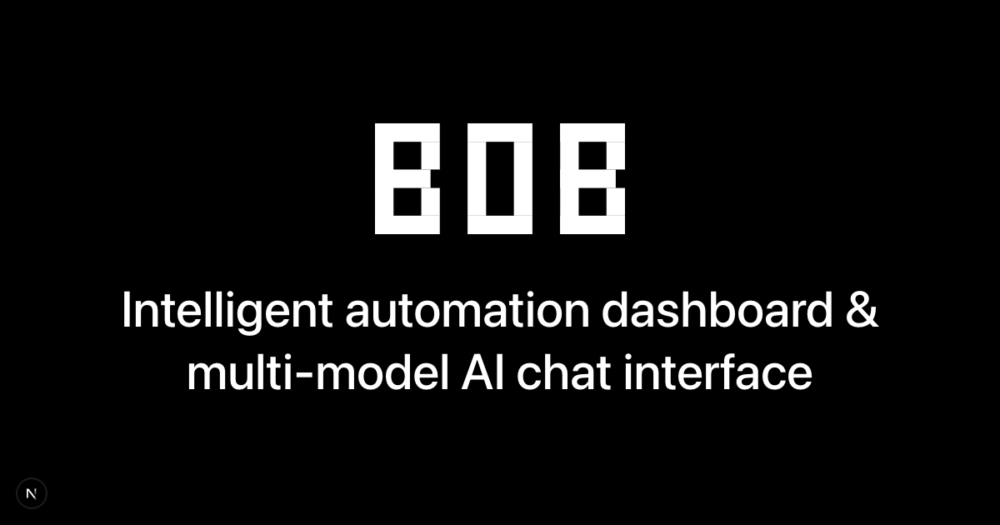

# Bob

**Intelligent automation dashboard with multi-model AI chat**

[bob.newth.ai](https://bob.newth.ai)

Bob delivers complete control over your AI interactions through a self-hosted dashboard that works with any AI model—from cloud providers to local instances running on your hardware.



## Why Bob

**Own Your AI Infrastructure**
Run everything on your own servers. Your conversations, files, and data never leave your control. Built for teams and individuals who need privacy without compromising functionality.

**Multi-Model Flexibility**
Switch seamlessly between OpenAI, Anthropic Claude, Google Gemini, Mistral, xAI Grok, Perplexity, and local models via Ollama. No vendor lock-in. Use your own API keys or run models locally.

**Professional Interface**
Clean, responsive design built with modern React components. Dark/light themes, customizable layouts, file uploads, and real-time synchronization. Designed for daily professional use.

**Enterprise-Ready Architecture**
Built on Next.js 15 with TypeScript. Supabase backend for authentication and data persistence when needed. Comprehensive testing with Vitest and Playwright. Docker-first deployment.

## Getting Started

Clone and run locally with your preferred AI models. See
[docs/QUICK_START.md](./docs/QUICK_START.md) for the complete onboarding guide
and troubleshooting tips.

```bash
git clone https://github.com/n3wth/bob.git
cd bob
npm ci
cp .env.local.example .env.local
```

Add your secrets to `.env.local` (minimum required for local development):
```bash
# Choose one or more AI providers
OPENAI_API_KEY=sk-...
ANTHROPIC_API_KEY=sk-ant-...
GOOGLE_GENERATIVE_AI_API_KEY=...

# Security keys (required)
CSRF_SECRET=$(openssl rand -hex 16)
ENCRYPTION_KEY=$(openssl rand -base64 32)
```

Start the development server on a fixed port to avoid conflicts with other
Next.js projects you might have running:
```bash
npm run dev -- --port=3000
```

If `3000` is already in use, pick another port (for example `3001`) and update
the URLs in `.env.local` accordingly. Playwright end-to-end tests boot on port
`3100`, so they will not interfere with your manual dev server.

Open [http://localhost:3000](http://localhost:3000) (or whichever port you
selected) and start chatting.

## Keyboard Shortcuts

Stay in the flow with built-in shortcuts (use `Ctrl` on Windows/Linux and `⌘` on macOS):

- `Enter` — Send your message
- `Shift` + `Enter` — Insert a new line
- `Ctrl`/`⌘` + `Enter` — Send while keeping focus in the composer
- `Esc` or `Ctrl`/`⌘` + `.` — Stop the current assistant response
- `Ctrl`/`⌘` + `Shift` + `X` — Clear the active chat (confirmation required)
- `Ctrl` + `Shift` + `↑` / `⌘` + `⌥` + `↑` — Jump to the previous conversation
- `Ctrl` + `Shift` + `↓` / `⌘` + `⌥` + `↓` — Jump to the next conversation
- `⌘` + `Shift` + `U` — Start a new chat
- `⌘` + `K` — Open chat history search
- `⌘` + `Shift` + `P` — Switch the active model

### Local AI with Ollama

For complete independence from cloud providers:

```bash
# Install Ollama
curl -fsSL https://ollama.ai/install.sh | sh
ollama pull llama3.2

# Bob will auto-detect your local models
npm run dev
```

### Full Stack Development

For advanced features including authentication, file uploads, and persistent chat history:

```bash
cp .env.local.example .env.local
# Configure Supabase variables in .env.local
docker-compose -f docker-compose.dev.yml up --build
```

Docker maps the application to [http://localhost:3001](http://localhost:3001)
by default to avoid clashes with a locally running Next.js instance. The stack
includes hot reload; configure Supabase if you need authentication or
persistent storage.

## Architecture

**Frontend**: Next.js 15 with TypeScript and Tailwind CSS
**UI Components**: shadcn/ui with Radix primitives
**AI Integration**: Vercel AI SDK for unified provider interface
**Backend**: Supabase for auth, database, and storage
**Testing**: Vitest for units, Playwright for E2E
**Deployment**: Docker with standalone output optimization

The application is built with a local-first approach—core functionality works without external services. Authentication, file uploads, and chat persistence are optional features that enhance the experience when configured.

## Development

**Requirements**: Node.js 18+, npm or pnpm

Refer to [Repository Guidelines](./AGENTS.md) for contribution standards, testing expectations, and PR checklists.

**Commands**:
- `npm run dev` — Development server with Turbopack
- `npm run build` — Production build
- `npm run type-check` — TypeScript validation
- `npm run lint` — Code linting
- `npm run test` — Unit tests with Vitest
- `npm run test:e2e` — End-to-end tests with Playwright

**Testing Strategy**:
Unit tests for components and utilities, E2E tests for critical user flows, visual regression testing for UI consistency, and performance monitoring for Core Web Vitals.

## Deployment

**Docker Production**:
```bash
docker-compose up
```

**Manual Deployment**:
Build with `npm run build` and deploy the `dist/` directory to any static hosting provider or Node.js environment.

**Configuration**:
See `.env.example` for all environment variables. Minimum requirement is one AI provider API key and security keys for encryption.

## License

Apache License 2.0 - See [LICENSE](./LICENSE) for details.
